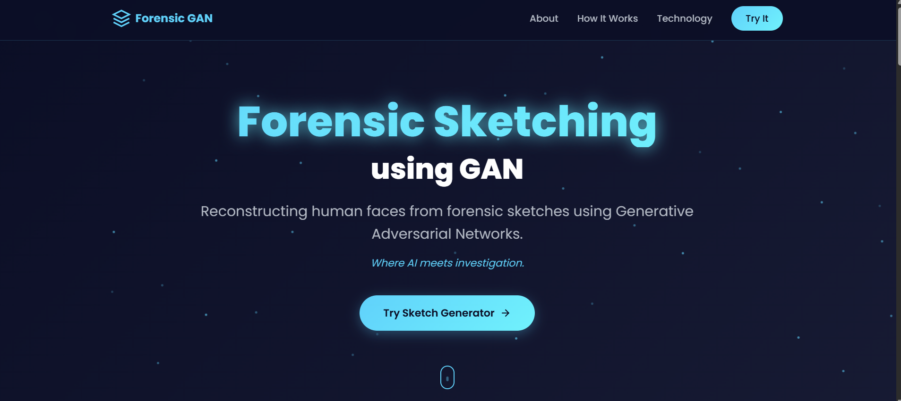
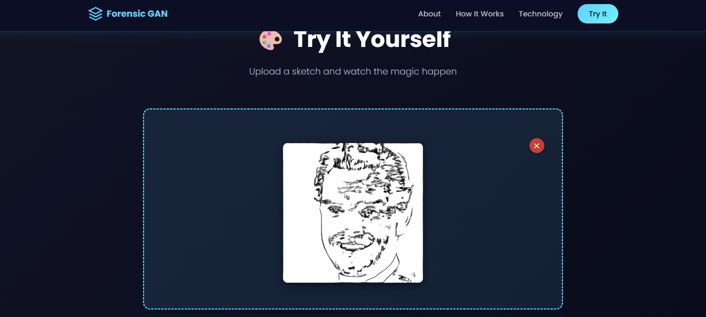
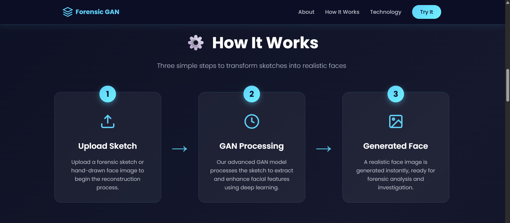
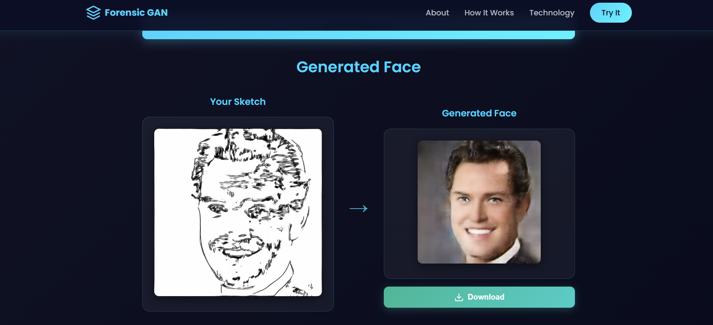

# Forensic Sketching Using GAN

Minimal Flask + PyTorch app that turns a sketch into a realistic face using your own trained generator.

## Highlights
- Drag & drop sketch uploads with live preview
- PyTorch-powered generator (GPU used automatically when available)
- Clean single-page UI (HTML/CSS/JS only)

## Model Overview
This project follows the **pix2pix** image-to-image translation setup:
- **Generator** – a U-Net with skip connections that maps a 256×256 RGB sketch to a realistic face. The encoder downsamples sketches to a latent code; the decoder upsamples while reusing low-level edges via skip links so fine pencil details survive.
- **Discriminator** – a PatchGAN that judges 70×70 patches instead of whole images. This keeps the model lightweight while forcing high-frequency realism (skin texture, hair strands).
- **Training objective** – adversarial loss (generator vs. discriminator) plus an L1 reconstruction term so the output stays close to the ground-truth face for each sketch.

Because the architecture matches the classic pix2pix paper, you can fine-tune it in Google Colab (or any PyTorch environment), export the generator weights, and drop them straight into this app for inference.

##  Download Pretrained GAN Model

The GAN generator weights are hosted on Google Drive.  
1. Download from this link:  
   https://drive.google.com/drive/folders/1kUufxbNeugVKKP-rk_IGFNbkTW_k36UK?usp=sharing  
2. Save the file as `generator_final.pth`.  
3. Place it under the `model/` directory of the project:  
   `model/generator_final.pth`  

## Quick Start
1. **Clone & enter the folder**
   ```bash
   git clone <repo-url>
   cd "D:\Projects\gan final"
   ```
   
2. **Create + activate a virtual environment**
   ```bash
   python -m venv venv
   .\venv\Scripts\Activate.ps1   # PowerShell
   ```
3. **Install requirements**
   ```bash
   pip install -r requirements.txt
   ```
4. **Drop in your model**
   - Copy the weights you trained to `model/generator_final.pth`
   - Paste the exact generator architecture into `model/generator_architecture.py`
5. **Run the app**
   ```bash
   python app.py
   ```
6. **Open the UI** – browse to `http://localhost:5000`, upload a sketch, press **Generate Face**.

## Screenshots 
  <p align="center">
  
  <br>
  <em>Home UI</em>
</p>

<p align="center">
  
  <br>
  <em>Upload Flow</em>
</p>

<p align="center">
  
  <br>
  <em>Processing State</em>
</p>

<p align="center">
  
  <br>
  <em>Generated Output</em>
</p>


## Project Layout
```
app.py                     # Flask server + routes
model/
  ├─ model_loader.py       # Loads weights + runs inference
  ├─ generator_architecture.py  # Paste your trained generator here
  └─ generator_final.pth   # Your checkpoint (not tracked in Git)
templates/index.html       # UI markup
static/style.css           # Styles
static/script.js           # Client logic
```

## Configuration Cheatsheet
- **Model path**: change the default in `model/model_loader.py` if your file name differs.
- **Max upload size**: update `app.config['MAX_CONTENT_LENGTH']` in `app.py` (default 16 MB).
- **Server settings**: tweak the `app.run()` call for port/host/debug options.


## Notes
- Designed for local demos; harden the Flask app before deploying publicly.
- The repo ignores `model/generator_final.pth`, so keep your trained weights backed up elsewhere.

Happy generating! 🎨✨

